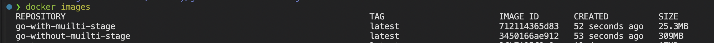

# LAB02 — Multi-Stage Docker Build (Go Application)

## Overview

This task demonstrates containerization of a compiled Go application using **multi-stage Docker builds**.
The goal is to separate the build environment from the runtime environment in order to reduce image size, improve security, and follow production best practices.

---

## Multi-Stage Build Strategy

The Dockerfile uses **two stages**:

1. **Builder stage** — compiles the Go application
2. **Runtime stage** — runs only the compiled binary

This approach ensures that the final image does **not** include compilers, SDKs, or build tools.

---

## Dockerfile

```dockerfile
# -------- Build stage --------
FROM golang:1.25-alpine AS builder

WORKDIR /app
COPY go.mod ./
RUN go mod download

COPY . .
RUN CGO_ENABLED=0 GOOS=linux GOARCH=amd64 go build -o app

# -------- Runtime stage --------
FROM alpine:latest

WORKDIR /app
COPY --from=builder /app/app .

EXPOSE 5000
CMD ["./app"]
```

---

## Stage-by-Stage Explanation

### Build Stage (`builder`)

```dockerfile
FROM golang:1.25-alpine AS builder
```

* Uses the official Go SDK image
* Required for compiling the application
* Includes Go compiler and build tools (large image)

```dockerfile
COPY go.mod ./
RUN go mod download
```

* Copies `go.mod` separately
* Allows Docker layer caching
* Dependencies are not re-downloaded unless `go.mod` changes

```dockerfile
RUN CGO_ENABLED=0 GOOS=linux GOARCH=amd64 go build -o app
```

* Produces a **static binary**
* Ensures compatibility with minimal runtime images
* No libc or system dependencies required

---

### Runtime Stage

```dockerfile
FROM alpine:latest
```

* Minimal Linux distribution
* Very small image size
* No compilers or SDKs included

```dockerfile
COPY --from=builder /app/app .
```

* Copies **only the compiled binary**
* No source code or build artifacts included

---

## Image Size Comparison

```bash
docker build --target builder -t go-with-multi-stage .
docker build --target builder -t go-without-multi-stage .
```

| Image                                   | Size |
| --------------------------------------- | ---------------- |
| Builder image (`golang:1.25-alpine`)    | ~309 MB          |
| Final runtime image (`alpine + binary`) | ~25.3 MB        |



## Docker Hub

The image was published to Docker Hub and is publicly accessible.

**Repository:**

```
https://hub.docker.com/repository/docker/essence666/app_golang_lab_2/general
```

### Analysis

* Image size reduced by **more than 95%**
* Smaller images:

  * Pull faster
  * Use less disk space
  * Reduce attack surface

---

## Why Multi-Stage Builds Matter for Compiled Languages

Without multi-stage builds:

* Final image would include:

  * Go compiler
  * Package manager
  * Build cache
* Image size would be unnecessarily large
* Increased security risks

With multi-stage builds:

* Build tools are discarded
* Only the runtime artifact is shipped
* Clear separation of responsibilities

---

## Security Considerations

* Final image does **not** include:

  * Compiler
  * Package manager
  * Source code
* Smaller attack surface
* Fewer CVEs
* Easier vulnerability scanning

---

## Why Not Use the Builder Image as Final?

* Builder image is designed for development, not production
* Contains unnecessary tools
* Much larger size
* Increased attack surface

---

## Can `FROM scratch` Be Used?

In theory, yes — because the binary is statically compiled.

However, `alpine` was chosen because:

* Easier debugging
* Provides basic utilities
* Better balance between minimalism and usability

---

## Build & Run Process

### Build Image

```bash
docker build -t go-info-service .
```

### Run Container

```bash
docker run -p 5000:5000 go-info-service
```

### Test Application

```bash
curl http://localhost:5000/health
```

---

## Challenges & Solutions

### Challenge: Reducing final image size

**Solution:**
Used multi-stage build and static compilation (`CGO_ENABLED=0`) to eliminate runtime dependencies.

### Challenge: Dependency caching

**Solution:**
Separated `go.mod` copy step to improve Docker layer caching.

---

## What I Learned

* How multi-stage builds dramatically reduce image size
* Why compiled languages benefit most from this approach
* How static compilation enables minimal runtime images
* How smaller images improve security and deployment speed

---

## Conclusion

Multi-stage Docker builds are essential for containerizing compiled applications in production.
They provide significant benefits in terms of **image size, security, and maintainability**, making them the recommended approach for Go, Rust, and similar languages.

