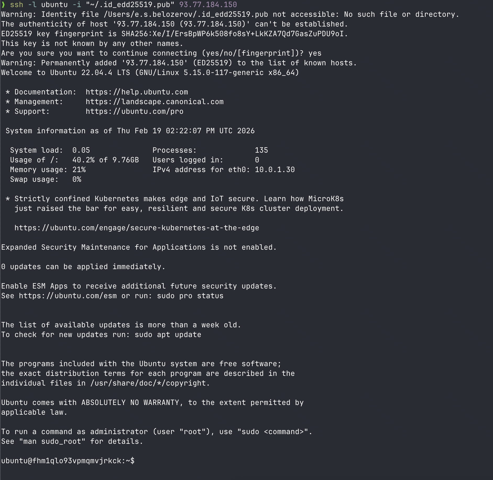
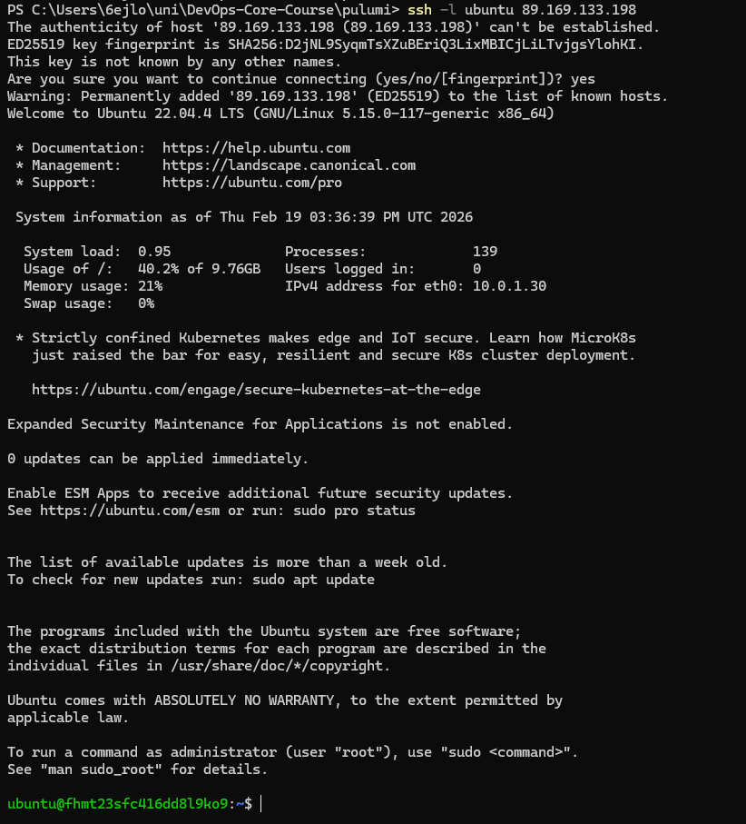

# Yandex Cloud Infrastructure Deployment with Terraform

## Cloud Provider Selection
I chose Yandex Cloud because it was specified in the course requirements and provides free credits for students. It offers reliable infrastructure services in the Russian region.

## Terraform Version
```bash
❯ terraform --version
Terraform v1.5.7
on darwin_arm64
+ provider registry.terraform.io/yandex-cloud/yandex v0.187.0

Your version of Terraform is out of date! The latest version
is 1.14.5. You can update by downloading from https://www.terraform.io/downloads.html
```

## Resources Created
- **VM name**: lab04-vm
- **Region/Zone**: ru-central1-a
- **Platform**: Intel Ice Lake (standard-v1)
- **vCPU**: 2 cores 20 % (since the cheaper one)
- **RAM**: 1 GB 
- **Boot disk**: 10 GB (Ubuntu 22.04 LTS)
- **Network**: Custom VPC with public subnet
- **Security group**: With open ports 22 (only for my ip), 80, 5000

## Public IP Address
```
93.77.191.229
```

## SSH Connection Command
```bash
ssh -i ~/.ssh/id_ed25519 -l ubuntu 93.77.184.150
```

## Terraform Plan Output
```
terraform plan

Terraform used the selected providers to generate the following execution plan. Resource actions are indicated with the following symbols:
  + create

Terraform will perform the following actions:

  # yandex_compute_instance.vm will be created
  + resource "yandex_compute_instance" "vm" {
      + created_at                = (known after apply)
      + folder_id                 = (known after apply)
      + fqdn                      = (known after apply)
      + gpu_cluster_id            = (known after apply)
      + hardware_generation       = (known after apply)
      + hostname                  = (known after apply)
      + id                        = (known after apply)
      + maintenance_grace_period  = (known after apply)
      + maintenance_policy        = (known after apply)
      + metadata                  = {
          + "ssh-keys" = <<-EOT
                ubuntu:ssh-ed25519 AAAAC3NzaC1lZDI1NTE5AAAAICmdbSKCFxCtdWPDN5DKaFsbrl1ZRDSWBZS2pQns/bM/ e.s.belozerov@macbook-RQM17PFPYP
            EOT
        }
      + name                      = "lab04-vm"
      + network_acceleration_type = "standard"
      + platform_id               = "standard-v1"
      + status                    = (known after apply)
      + zone                      = (known after apply)

      + boot_disk {
          + auto_delete = true
          + device_name = (known after apply)
          + disk_id     = (known after apply)
          + mode        = (known after apply)

          + initialize_params {
              + block_size  = (known after apply)
              + description = (known after apply)
              + image_id    = "fd84kp940dsrccckilj6"
              + name        = (known after apply)
              + size        = 10
              + snapshot_id = (known after apply)
              + type        = "network-hdd"
            }
        }

      + network_interface {
          + index              = (known after apply)
          + ip_address         = (known after apply)
          + ipv4               = true
          + ipv6               = (known after apply)
          + ipv6_address       = (known after apply)
          + mac_address        = (known after apply)
          + nat                = true
          + nat_ip_address     = (known after apply)
          + nat_ip_version     = (known after apply)
          + security_group_ids = (known after apply)
          + subnet_id          = (known after apply)
        }

      + resources {
          + core_fraction = 20
          + cores         = 2
          + memory        = 1
        }
    }

  # yandex_vpc_network.lab_network will be created
  + resource "yandex_vpc_network" "lab_network" {
      + created_at                = (known after apply)
      + default_security_group_id = (known after apply)
      + folder_id                 = (known after apply)
      + id                        = (known after apply)
      + labels                    = (known after apply)
      + name                      = "lab-network"
      + subnet_ids                = (known after apply)
    }

  # yandex_vpc_security_group.lab_sg will be created
  + resource "yandex_vpc_security_group" "lab_sg" {
      + created_at = (known after apply)
      + folder_id  = (known after apply)
      + id         = (known after apply)
      + labels     = (known after apply)
      + name       = "lab-sg"
      + network_id = (known after apply)
      + status     = (known after apply)

      + egress {
          + from_port      = -1
          + id             = (known after apply)
          + labels         = (known after apply)
          + port           = -1
          + protocol       = "ANY"
          + to_port        = -1
          + v4_cidr_blocks = [
              + "0.0.0.0/0",
            ]
          + v6_cidr_blocks = []
        }

      + ingress {
          + description    = "App port"
          + from_port      = -1
          + id             = (known after apply)
          + labels         = (known after apply)
          + port           = 5000
          + protocol       = "TCP"
          + to_port        = -1
          + v4_cidr_blocks = [
              + "0.0.0.0/0",
            ]
          + v6_cidr_blocks = []
        }
      + ingress {
          + description    = "HTTP"
          + from_port      = -1
          + id             = (known after apply)
          + labels         = (known after apply)
          + port           = 80
          + protocol       = "TCP"
          + to_port        = -1
          + v4_cidr_blocks = [
              + "0.0.0.0/0",
            ]
          + v6_cidr_blocks = []
        }
      + ingress {
          + description    = "SSH"
          + from_port      = -1
          + id             = (known after apply)
          + labels         = (known after apply)
          + port           = 22
          + protocol       = "TCP"
          + to_port        = -1
          + v4_cidr_blocks = [
              + "188.130.155.165/32",
            ]
          + v6_cidr_blocks = []
        }
    }

  # yandex_vpc_subnet.lab_subnet will be created
  + resource "yandex_vpc_subnet" "lab_subnet" {
      + created_at     = (known after apply)
      + folder_id      = (known after apply)
      + id             = (known after apply)
      + labels         = (known after apply)
      + name           = "lab-subnet"
      + network_id     = (known after apply)
      + v4_cidr_blocks = [
          + "10.0.1.0/24",
        ]
      + v6_cidr_blocks = (known after apply)
      + zone           = "ru-central1-a"
    }

Plan: 4 to add, 0 to change, 0 to destroy.

Changes to Outputs:
  + public_ip = (known after apply)

───────────────────────────────────────────────────────────────────────────────────────────────────────────────────────────────────────────────────────────────────────────

Note: You didn't use the -out option to save this plan, so Terraform can't guarantee to take exactly these actions if you run "terraform apply" now.
~/uni/DevOps-Core-Course/terraform lab04 !1 ?2 ❯                                                                                                                   17:18:07
```

## Terraform Apply Output
```
❯ terraform apply

Terraform used the selected providers to generate the following execution plan. Resource actions are indicated with the following symbols:
  + create

Terraform will perform the following actions:

  # yandex_compute_instance.vm will be created
  + resource "yandex_compute_instance" "vm" {
      + created_at                = (known after apply)
      + folder_id                 = (known after apply)
      + fqdn                      = (known after apply)
      + gpu_cluster_id            = (known after apply)
      + hardware_generation       = (known after apply)
      + hostname                  = (known after apply)
      + id                        = (known after apply)
      + maintenance_grace_period  = (known after apply)
      + maintenance_policy        = (known after apply)
      + metadata                  = {
          + "ssh-keys" = <<-EOT
                ubuntu:ssh-ed25519 AAAAC3NzaC1lZDI1NTE5AAAAICmdbSKCFxCtdWPDN5DKaFsbrl1ZRDSWBZS2pQns/bM/ e.s.belozerov@macbook-RQM17PFPYP
            EOT
        }
      + name                      = "lab04-vm"
      + network_acceleration_type = "standard"
      + platform_id               = "standard-v1"
      + status                    = (known after apply)
      + zone                      = (known after apply)

      + boot_disk {
          + auto_delete = true
          + device_name = (known after apply)
          + disk_id     = (known after apply)
          + mode        = (known after apply)

          + initialize_params {
              + block_size  = (known after apply)
              + description = (known after apply)
              + image_id    = "fd84kp940dsrccckilj6"
              + name        = (known after apply)
              + size        = 10
              + snapshot_id = (known after apply)
              + type        = "network-hdd"
            }
        }

      + network_interface {
          + index              = (known after apply)
          + ip_address         = (known after apply)
          + ipv4               = true
          + ipv6               = (known after apply)
          + ipv6_address       = (known after apply)
          + mac_address        = (known after apply)
          + nat                = true
          + nat_ip_address     = (known after apply)
          + nat_ip_version     = (known after apply)
          + security_group_ids = (known after apply)
          + subnet_id          = (known after apply)
        }

      + resources {
          + core_fraction = 20
          + cores         = 2
          + memory        = 1
        }
    }

  # yandex_vpc_network.lab_network will be created
  + resource "yandex_vpc_network" "lab_network" {
      + created_at                = (known after apply)
      + default_security_group_id = (known after apply)
      + folder_id                 = (known after apply)
      + id                        = (known after apply)
      + labels                    = (known after apply)
      + name                      = "lab-network"
      + subnet_ids                = (known after apply)
    }

  # yandex_vpc_security_group.lab_sg will be created
  + resource "yandex_vpc_security_group" "lab_sg" {
      + created_at = (known after apply)
      + folder_id  = (known after apply)
      + id         = (known after apply)
      + labels     = (known after apply)
      + name       = "lab-sg"
      + network_id = (known after apply)
      + status     = (known after apply)

      + egress {
          + from_port      = -1
          + id             = (known after apply)
          + labels         = (known after apply)
          + port           = -1
          + protocol       = "ANY"
          + to_port        = -1
          + v4_cidr_blocks = [
              + "0.0.0.0/0",
            ]
          + v6_cidr_blocks = []
        }

      + ingress {
          + description    = "App port"
          + from_port      = -1
          + id             = (known after apply)
          + labels         = (known after apply)
          + port           = 5000
          + protocol       = "TCP"
          + to_port        = -1
          + v4_cidr_blocks = [
              + "0.0.0.0/0",
            ]
          + v6_cidr_blocks = []
        }
      + ingress {
          + description    = "HTTP"
          + from_port      = -1
          + id             = (known after apply)
          + labels         = (known after apply)
          + port           = 80
          + protocol       = "TCP"
          + to_port        = -1
          + v4_cidr_blocks = [
              + "0.0.0.0/0",
            ]
          + v6_cidr_blocks = []
        }
      + ingress {
          + description    = "SSH"
          + from_port      = -1
          + id             = (known after apply)
          + labels         = (known after apply)
          + port           = 22
          + protocol       = "TCP"
          + to_port        = -1
          + v4_cidr_blocks = [
              + "188.130.155.165/32",
            ]
          + v6_cidr_blocks = []
        }
    }

  # yandex_vpc_subnet.lab_subnet will be created
  + resource "yandex_vpc_subnet" "lab_subnet" {
      + created_at     = (known after apply)
      + folder_id      = (known after apply)
      + id             = (known after apply)
      + labels         = (known after apply)
      + name           = "lab-subnet"
      + network_id     = (known after apply)
      + v4_cidr_blocks = [
          + "10.0.1.0/24",
        ]
      + v6_cidr_blocks = (known after apply)
      + zone           = "ru-central1-a"
    }

Plan: 4 to add, 0 to change, 0 to destroy.

Changes to Outputs:
  + public_ip = (known after apply)

Do you want to perform these actions?
  Terraform will perform the actions described above.
  Only 'yes' will be accepted to approve.

  Enter a value: yes

yandex_vpc_network.lab_network: Creating...
yandex_vpc_network.lab_network: Creation complete after 3s [id=enp63dqhauntlc50ddu4]
yandex_vpc_subnet.lab_subnet: Creating...
yandex_vpc_security_group.lab_sg: Creating...
yandex_vpc_subnet.lab_subnet: Creation complete after 0s [id=e9bqhbsacgdh594stfa8]
yandex_vpc_security_group.lab_sg: Creation complete after 2s [id=enpv8vdugs0i88u2ff7s]
yandex_compute_instance.vm: Creating...
yandex_compute_instance.vm: Still creating... [10s elapsed]
yandex_compute_instance.vm: Still creating... [20s elapsed]
yandex_compute_instance.vm: Still creating... [30s elapsed]
yandex_compute_instance.vm: Still creating... [40s elapsed]
yandex_compute_instance.vm: Still creating... [50s elapsed]
yandex_compute_instance.vm: Creation complete after 51s [id=fhm1qlo93vpmqmvjrkck]

Apply complete! Resources: 4 added, 0 changed, 0 destroyed.

Outputs:

public_ip = "93.77.184.150"
~/uni/DevOps-Core-Course/terraform lab04 !1 ?2 ❯                                                                                                             1m 0s 17:19:35
```

## Proof of SSH Access



First, i use the diffirent laptop to confirm pulumi part, since on my work laptop vpn is prohibited

## Pulumi Version and Language

* **Pulumi version**:
```
PS C:\Users\6ejlo\uni\DevOps-Core-Course\pulumi> pulumi version
v3.222.0
```
* **Language**: Go

## Code Differences from Terraform

* Infrastructure is defined using Go code instead of HCL.
* Resource creation is wrapped in `pulumi.Run` with `context`.
* Resources and arguments are Go structs (`VpcNetworkArgs`, `ComputeInstanceArgs`, etc.).
* Security rules are defined using arrays of structs (`IngressRuleArgs`, `EgressRuleArgs`).

## Advantages Discovered

* Code can use loops, functions, and variables directly.
* Type checking in Go helps avoid mistakes in resource parameters.
* Outputs can be exported programmatically and used in other Go code.
* Easier integration with external APIs and file reading.

## Challenges Encountered

* Initial issues with Go module imports and package paths.
* Pulumi requires correct JSON format for Yandex service account key.
* Struct fields differ from Terraform HCL blocks (Ingress/Egress rules, memory type, etc.).
* `Int` vs `Float64` type mismatch for memory resources.

## Terminal Output

### Pulumi Preview

```
PS C:\Users\6ejlo\uni\DevOps-Core-Course\pulumi> pulumi preview
Previewing update (dev)

View in Browser (Ctrl+O): https://app.pulumi.com/essence-666-org/project/dev/previews/ebf20292-9889-4f48-a52d-262378464920

     Type                                  Name              Plan
 +   pulumi:pulumi:Stack                   project-dev       create
 +   ├─ pulumi:providers:yandex            yc                create
 +   ├─ yandex:index:VpcNetwork            lab-network       create
 +   ├─ yandex:index:VpcSecurityGroup      lab-sg            create
 +   ├─ yandex:index:VpcSubnet             lab-subnet        create
 +   ├─ yandex:index:VpcSecurityGroupRule  allow-all-egress  create
 +   ├─ yandex:index:VpcSecurityGroupRule  allow-app         create
 +   ├─ yandex:index:VpcSecurityGroupRule  allow-http        create
 +   ├─ yandex:index:VpcSecurityGroupRule  allow-ssh         create
 +   └─ yandex:index:ComputeInstance       lab-vm            create
Outputs:
    public_ip: [unknown]

Resources:
    + 10 to create
```

### Pulumi Up

```
PS C:\Users\6ejlo\uni\DevOps-Core-Course\pulumi> pulumi up
Previewing update (dev)

View in Browser (Ctrl+O): https://app.pulumi.com/essence-666-org/project/dev/previews/594eabdb-5ef5-4096-bd16-5cf3d1359ab5

     Type                                  Name              Plan
 +   pulumi:pulumi:Stack                   project-dev       create
 +   ├─ pulumi:providers:yandex            yc                create
 +   ├─ yandex:index:VpcNetwork            lab-network       create
 +   ├─ yandex:index:VpcSecurityGroup      lab-sg            create
 +   ├─ yandex:index:VpcSubnet             lab-subnet        create
 +   ├─ yandex:index:VpcSecurityGroupRule  allow-all-egress  create
 +   ├─ yandex:index:VpcSecurityGroupRule  allow-app         create
 +   ├─ yandex:index:VpcSecurityGroupRule  allow-http        create
 +   ├─ yandex:index:VpcSecurityGroupRule  allow-ssh         create
 +   └─ yandex:index:ComputeInstance       lab-vm            create
Outputs:
    public_ip: [unknown]

Resources:
    + 10 to create

Do you want to perform this update? details
+ pulumi:pulumi:Stack: (create)
    [urn=urn:pulumi:dev::project::pulumi:pulumi:Stack::project-dev]
    + pulumi:providers:yandex: (create)
        [urn=urn:pulumi:dev::project::pulumi:providers:yandex::yc]
        cloudId              : "b1g66sjilsdsanah7cpe"
        folderId             : "b1g0cnocne76e6s8gf33"
        serviceAccountKeyFile: "key.json"
        version              : "0.13.0"
        zone                 : "ru-central1-a"
    + yandex:index/vpcNetwork:VpcNetwork: (create)
        [urn=urn:pulumi:dev::project::yandex:index/vpcNetwork:VpcNetwork::lab-network]
        [provider=urn:pulumi:dev::project::pulumi:providers:yandex::yc::04da6b54-80e4-46f7-96ec-b56ff0331ba9]
        name      : "lab-network"
    + yandex:index/vpcSecurityGroup:VpcSecurityGroup: (create)
        [urn=urn:pulumi:dev::project::yandex:index/vpcSecurityGroup:VpcSecurityGroup::lab-sg]
        [provider=urn:pulumi:dev::project::pulumi:providers:yandex::yc::04da6b54-80e4-46f7-96ec-b56ff0331ba9]
        name      : "lab-sg"
        networkId : [unknown]
    + yandex:index/vpcSubnet:VpcSubnet: (create)
        [urn=urn:pulumi:dev::project::yandex:index/vpcSubnet:VpcSubnet::lab-subnet]
        [provider=urn:pulumi:dev::project::pulumi:providers:yandex::yc::04da6b54-80e4-46f7-96ec-b56ff0331ba9]
        name        : "lab-subnet"
        networkId   : [unknown]
        v4CidrBlocks: [
            [0]: "10.0.1.0/24"
        ]
        zone        : "ru-central1-a"
    + yandex:index/vpcSecurityGroupRule:VpcSecurityGroupRule: (create)
        [urn=urn:pulumi:dev::project::yandex:index/vpcSecurityGroupRule:VpcSecurityGroupRule::allow-all-egress]
        [provider=urn:pulumi:dev::project::pulumi:providers:yandex::yc::04da6b54-80e4-46f7-96ec-b56ff0331ba9]
        direction           : "egress"
        fromPort            : -1
        port                : -1
        protocol            : "ANY"
        securityGroupBinding: [unknown]
        toPort              : -1
        v4CidrBlocks        : [
            [0]: "0.0.0.0/0"
        ]
    + yandex:index/vpcSecurityGroupRule:VpcSecurityGroupRule: (create)
        [urn=urn:pulumi:dev::project::yandex:index/vpcSecurityGroupRule:VpcSecurityGroupRule::allow-app]
        [provider=urn:pulumi:dev::project::pulumi:providers:yandex::yc::04da6b54-80e4-46f7-96ec-b56ff0331ba9]
        description         : "App"
        direction           : "ingress"
        fromPort            : -1
        port                : 5000
        protocol            : "TCP"
        securityGroupBinding: [unknown]
        toPort              : -1
        v4CidrBlocks        : [
            [0]: "0.0.0.0/0"
        ]
    + yandex:index/vpcSecurityGroupRule:VpcSecurityGroupRule: (create)
        [urn=urn:pulumi:dev::project::yandex:index/vpcSecurityGroupRule:VpcSecurityGroupRule::allow-http]
        [provider=urn:pulumi:dev::project::pulumi:providers:yandex::yc::04da6b54-80e4-46f7-96ec-b56ff0331ba9]
        description         : "HTTP"
        direction           : "ingress"
        fromPort            : -1
        port                : 80
        protocol            : "TCP"
        securityGroupBinding: [unknown]
        toPort              : -1
        v4CidrBlocks        : [
            [0]: "0.0.0.0/0"
        ]
    + yandex:index/vpcSecurityGroupRule:VpcSecurityGroupRule: (create)
        [urn=urn:pulumi:dev::project::yandex:index/vpcSecurityGroupRule:VpcSecurityGroupRule::allow-ssh]
        [provider=urn:pulumi:dev::project::pulumi:providers:yandex::yc::04da6b54-80e4-46f7-96ec-b56ff0331ba9]
        description         : "SSH"
        direction           : "ingress"
        fromPort            : -1
        port                : 22
        protocol            : "TCP"
        securityGroupBinding: [unknown]
        toPort              : -1
        v4CidrBlocks        : [
            [0]: "188.130.155.165/32"
        ]
    + yandex:index/computeInstance:ComputeInstance: (create)
        [urn=urn:pulumi:dev::project::yandex:index/computeInstance:ComputeInstance::lab-vm]
        [provider=urn:pulumi:dev::project::pulumi:providers:yandex::yc::04da6b54-80e4-46f7-96ec-b56ff0331ba9]
        bootDisk               : {
            autoDelete      : true
            initializeParams: {
                imageId   : "fd84kp940dsrccckilj6"
                size      : 10
                type      : "network-hdd"
            }
        }
        metadata               : {
            ssh-keys  : "ubuntu:ssh-ed25519 AAAAC3NzaC1lZDI1NTE5AAAAILPirly21NjP7vRbQxzV9aak+Zk4agARAw7jpXyS9C7/ 6ejlo@alohadance"
        }
        name                   : "lab-vm"
        networkAccelerationType: "standard"
        networkInterfaces      : [
            [0]: {
                ipv4            : true
                nat             : true
                securityGroupIds: [
                    [0]: [unknown]
                ]
                subnetId        : [unknown]
            }
        ]
        platformId             : "standard-v1"
        resources              : {
            coreFraction: 20
            cores       : 2
            memory      : 1
        }
        zone                   : "ru-central1-a"
    --outputs:--
    public_ip: [unknown]

Do you want to perform this update? yes
Updating (dev)

View in Browser (Ctrl+O): https://app.pulumi.com/essence-666-org/project/dev/updates/5

     Type                                  Name              Status
 +   pulumi:pulumi:Stack                   project-dev       created (143s)
 +   ├─ pulumi:providers:yandex            yc                created (0.56s)
 +   ├─ yandex:index:VpcNetwork            lab-network       created (7s)
 +   ├─ yandex:index:VpcSubnet             lab-subnet        created (0.84s)
 +   ├─ yandex:index:VpcSecurityGroup      lab-sg            created (2s)
 +   ├─ yandex:index:VpcSecurityGroupRule  allow-app         created (0.96s)
 +   ├─ yandex:index:VpcSecurityGroupRule  allow-ssh         created (1s)
 +   ├─ yandex:index:VpcSecurityGroupRule  allow-http        created (2s)
 +   ├─ yandex:index:VpcSecurityGroupRule  allow-all-egress  created (2s)
 +   └─ yandex:index:ComputeInstance       lab-vm            created (130s)
Outputs:
    public_ip: "89.169.133.198"

Resources:
    + 10 created

Duration: 2m27s
```

### SSH Connection to VM

```
ssh -l ubuntu 89.169.133.198
```



### VM Public IP Address

```
89.169.133.198 (will be deleted)
```

---

## 4. Terraform vs Pulumi Comparison

**Ease of Learning**
Terraform was easier to start with because HCL syntax is simple and declarative. Pulumi required understanding Go modules, types, and struct arguments, which added complexity at first.

**Code Readability**
Terraform HCL is more readable for small configurations. Pulumi code can be longer due to explicit structs and arrays, but it is more flexible and supports programming logic.

**Debugging**
Debugging Terraform is easier when errors relate to resource parameters; errors are usually descriptive. Pulumi errors often involve Go types or missing imports, which can be harder to trace at first.

**Documentation**
Terraform has extensive documentation and many examples for Yandex Cloud. Pulumi docs are smaller and sometimes lack detailed examples for advanced use cases.

**Use Case**
Use Terraform for straightforward, declarative infrastructure deployments. Use Pulumi when you need code logic, loops, or integration with other programs or APIs.

---

## 5. Lab 5 Preparation & Cleanup

**VM for Lab 5**

* Are you keeping your VM for Lab 5? No
* If no: I will recreate a cloud VM for Lab 5 using either Terraform or Pulumi.

**Cleanup Status**

* Pulumi resources destroyed:

```
PS C:\Users\6ejlo\uni\DevOps-Core-Course\pulumi> pulumi destroy
Previewing destroy (dev)

View in Browser (Ctrl+O): https://app.pulumi.com/essence-666-org/project/dev/previews/e1933499-99ea-4bbe-9a5a-d30a7d598f2e

     Type                                  Name              Plan
 -   pulumi:pulumi:Stack                   project-dev       delete
 -   ├─ yandex:index:VpcSecurityGroupRule  allow-app         delete
 -   ├─ yandex:index:ComputeInstance       lab-vm            delete
 -   ├─ yandex:index:VpcSecurityGroupRule  allow-ssh         delete
 -   ├─ yandex:index:VpcSecurityGroupRule  allow-http        delete
 -   ├─ yandex:index:VpcSecurityGroupRule  allow-all-egress  delete
 -   ├─ yandex:index:VpcSubnet             lab-subnet        delete
 -   ├─ yandex:index:VpcSecurityGroup      lab-sg            delete
 -   ├─ yandex:index:VpcNetwork            lab-network       delete
 -   └─ pulumi:providers:yandex            yc                delete
Outputs:
  - public_ip: "89.169.133.198"

Resources:
    - 10 to delete

Do you want to perform this destroy? details
- yandex:index/vpcSecurityGroupRule:VpcSecurityGroupRule: (delete)
    [id=enpv6504c4nf3ing8csb]
    [urn=urn:pulumi:dev::project::yandex:index/vpcSecurityGroupRule:VpcSecurityGroupRule::allow-app]
    [provider=urn:pulumi:dev::project::pulumi:providers:yandex::yc::7150d30e-bc1e-44e4-911a-80e433f8958a]
- yandex:index/computeInstance:ComputeInstance: (delete)
    [id=fhmt23sfc416dd8l9ko9]
    [urn=urn:pulumi:dev::project::yandex:index/computeInstance:ComputeInstance::lab-vm]
    [provider=urn:pulumi:dev::project::pulumi:providers:yandex::yc::7150d30e-bc1e-44e4-911a-80e433f8958a]
- yandex:index/vpcSecurityGroupRule:VpcSecurityGroupRule: (delete)
    [id=enp8kpsfenu0fgojl7va]
    [urn=urn:pulumi:dev::project::yandex:index/vpcSecurityGroupRule:VpcSecurityGroupRule::allow-ssh]
    [provider=urn:pulumi:dev::project::pulumi:providers:yandex::yc::7150d30e-bc1e-44e4-911a-80e433f8958a]
- yandex:index/vpcSecurityGroupRule:VpcSecurityGroupRule: (delete)
    [id=enpq61601fl08jvderd4]
    [urn=urn:pulumi:dev::project::yandex:index/vpcSecurityGroupRule:VpcSecurityGroupRule::allow-http]
    [provider=urn:pulumi:dev::project::pulumi:providers:yandex::yc::7150d30e-bc1e-44e4-911a-80e433f8958a]
- yandex:index/vpcSecurityGroupRule:VpcSecurityGroupRule: (delete)
    [id=enpvnr031hkb34qoe480]
    [urn=urn:pulumi:dev::project::yandex:index/vpcSecurityGroupRule:VpcSecurityGroupRule::allow-all-egress]
    [provider=urn:pulumi:dev::project::pulumi:providers:yandex::yc::7150d30e-bc1e-44e4-911a-80e433f8958a]
- yandex:index/vpcSubnet:VpcSubnet: (delete)
    [id=e9b6tlha48vpbcp8icdk]
    [urn=urn:pulumi:dev::project::yandex:index/vpcSubnet:VpcSubnet::lab-subnet]
    [provider=urn:pulumi:dev::project::pulumi:providers:yandex::yc::7150d30e-bc1e-44e4-911a-80e433f8958a]
- yandex:index/vpcSecurityGroup:VpcSecurityGroup: (delete)
    [id=enp5ej4a80ugh804rdfv]
    [urn=urn:pulumi:dev::project::yandex:index/vpcSecurityGroup:VpcSecurityGroup::lab-sg]
    [provider=urn:pulumi:dev::project::pulumi:providers:yandex::yc::7150d30e-bc1e-44e4-911a-80e433f8958a]
- yandex:index/vpcNetwork:VpcNetwork: (delete)
    [id=enp16oqts2c4nfpools0]
    [urn=urn:pulumi:dev::project::yandex:index/vpcNetwork:VpcNetwork::lab-network]
    [provider=urn:pulumi:dev::project::pulumi:providers:yandex::yc::7150d30e-bc1e-44e4-911a-80e433f8958a]
- pulumi:providers:yandex: (delete)
    [id=7150d30e-bc1e-44e4-911a-80e433f8958a]
    [urn=urn:pulumi:dev::project::pulumi:providers:yandex::yc]
- pulumi:pulumi:Stack: (delete)
    [urn=urn:pulumi:dev::project::pulumi:pulumi:Stack::project-dev]
    --outputs:--
  - public_ip: "89.169.133.198"

Do you want to perform this destroy? yes
Destroying (dev)

View in Browser (Ctrl+O): https://app.pulumi.com/essence-666-org/project/dev/updates/6

     Type                                  Name              Status
 -   pulumi:pulumi:Stack                   project-dev       deleted (0.27s)
 -   ├─ yandex:index:VpcSecurityGroupRule  allow-all-egress  deleted (5s)
 -   ├─ yandex:index:VpcSecurityGroupRule  allow-ssh         deleted (6s)
 -   ├─ yandex:index:VpcSecurityGroupRule  allow-app         deleted (6s)
 -   ├─ yandex:index:VpcSecurityGroupRule  allow-http        deleted (7s)
 -   ├─ yandex:index:ComputeInstance       lab-vm            deleted (39s)
 -   ├─ yandex:index:VpcSecurityGroup      lab-sg            deleted (0.91s)
 -   ├─ yandex:index:VpcSubnet             lab-subnet        deleted (5s)
 -   ├─ yandex:index:VpcNetwork            lab-network       deleted (1s)
 -   └─ pulumi:providers:yandex            yc                deleted (0.27s)
Outputs:
  - public_ip: "89.169.133.198"

Resources:
    - 10 deleted

Duration: 49s

The resources in the stack have been deleted, but the history and configuration associated with the stack are still maintained.
If you want to remove the stack completely, run `pulumi stack rm dev`.
PS C:\Users\6ejlo\uni\DevOps-Core-Course\pulumi>
```

* Terraform resources destroyed:

```

❯ terraform destroy
yandex_vpc_network.lab_network: Refreshing state... [id=enp63dqhauntlc50ddu4]
yandex_vpc_subnet.lab_subnet: Refreshing state... [id=e9bqhbsacgdh594stfa8]
yandex_vpc_security_group.lab_sg: Refreshing state... [id=enpv8vdugs0i88u2ff7s]
yandex_compute_instance.vm: Refreshing state... [id=fhm1qlo93vpmqmvjrkck]

Terraform used the selected providers to generate the following execution plan. Resource actions are indicated with the following symbols:
  - destroy

Terraform will perform the following actions:

  # yandex_compute_instance.vm will be destroyed
  - resource "yandex_compute_instance" "vm" {
      - created_at                = "2026-02-19T14:18:45Z" -> null
      - folder_id                 = "b1g0cnocne76e6s8gf33" -> null
      - fqdn                      = "fhm1qlo93vpmqmvjrkck.auto.internal" -> null
      - hardware_generation       = [
          - {
              - generation2_features = []
              - legacy_features      = [
                  - {
                      - pci_topology = "PCI_TOPOLOGY_V1"
                    },
                ]
            },
        ] -> null
      - id                        = "fhm1qlo93vpmqmvjrkck" -> null
      - labels                    = {} -> null
      - metadata                  = {
          - "ssh-keys" = <<-EOT
                ubuntu:ssh-ed25519 AAAAC3NzaC1lZDI1NTE5AAAAICmdbSKCFxCtdWPDN5DKaFsbrl1ZRDSWBZS2pQns/bM/ e.s.belozerov@macbook-RQM17PFPYP
            EOT
        } -> null
      - name                      = "lab04-vm" -> null
      - network_acceleration_type = "standard" -> null
      - platform_id               = "standard-v1" -> null
      - status                    = "running" -> null
      - zone                      = "ru-central1-a" -> null

      - boot_disk {
          - auto_delete = true -> null
          - device_name = "fhmk9knek2me3k1lsl0e" -> null
          - disk_id     = "fhmk9knek2me3k1lsl0e" -> null
          - mode        = "READ_WRITE" -> null

          - initialize_params {
              - block_size = 4096 -> null
              - image_id   = "fd84kp940dsrccckilj6" -> null
              - size       = 10 -> null
              - type       = "network-hdd" -> null
            }
        }

      - metadata_options {
          - aws_v1_http_endpoint = 1 -> null
          - aws_v1_http_token    = 2 -> null
          - gce_http_endpoint    = 1 -> null
          - gce_http_token       = 1 -> null
        }

      - network_interface {
          - index              = 0 -> null
          - ip_address         = "10.0.1.30" -> null
          - ipv4               = true -> null
          - ipv6               = false -> null
          - mac_address        = "d0:0d:1d:57:09:1f" -> null
          - nat                = true -> null
          - nat_ip_address     = "93.77.184.150" -> null
          - nat_ip_version     = "IPV4" -> null
          - security_group_ids = [
              - "enpv8vdugs0i88u2ff7s",
            ] -> null
          - subnet_id          = "e9bqhbsacgdh594stfa8" -> null
        }

      - placement_policy {
          - host_affinity_rules       = [] -> null
          - placement_group_partition = 0 -> null
        }

      - resources {
          - core_fraction = 20 -> null
          - cores         = 2 -> null
          - gpus          = 0 -> null
          - memory        = 1 -> null
        }

      - scheduling_policy {
          - preemptible = false -> null
        }
    }

  # yandex_vpc_network.lab_network will be destroyed
  - resource "yandex_vpc_network" "lab_network" {
      - created_at                = "2026-02-19T14:18:39Z" -> null
      - default_security_group_id = "enpohhna9tmkh569c3r0" -> null
      - folder_id                 = "b1g0cnocne76e6s8gf33" -> null
      - id                        = "enp63dqhauntlc50ddu4" -> null
      - labels                    = {} -> null
      - name                      = "lab-network" -> null
      - subnet_ids                = [
          - "e9bqhbsacgdh594stfa8",
        ] -> null
    }

  # yandex_vpc_security_group.lab_sg will be destroyed
  - resource "yandex_vpc_security_group" "lab_sg" {
      - created_at = "2026-02-19T14:18:44Z" -> null
      - folder_id  = "b1g0cnocne76e6s8gf33" -> null
      - id         = "enpv8vdugs0i88u2ff7s" -> null
      - labels     = {} -> null
      - name       = "lab-sg" -> null
      - network_id = "enp63dqhauntlc50ddu4" -> null
      - status     = "ACTIVE" -> null

      - egress {
          - from_port      = -1 -> null
          - id             = "enpkos8fbdcv5ref1i8p" -> null
          - labels         = {} -> null
          - port           = -1 -> null
          - protocol       = "ANY" -> null
          - to_port        = -1 -> null
          - v4_cidr_blocks = [
              - "0.0.0.0/0",
            ] -> null
          - v6_cidr_blocks = [] -> null
        }

      - ingress {
          - description    = "App port" -> null
          - from_port      = -1 -> null
          - id             = "enpo08kcb0g2edrkmo87" -> null
          - labels         = {} -> null
          - port           = 5000 -> null
          - protocol       = "TCP" -> null
          - to_port        = -1 -> null
          - v4_cidr_blocks = [
              - "0.0.0.0/0",
            ] -> null
          - v6_cidr_blocks = [] -> null
        }
      - ingress {
          - description    = "HTTP" -> null
          - from_port      = -1 -> null
          - id             = "enpc7pat230ck8rea187" -> null
          - labels         = {} -> null
          - port           = 80 -> null
          - protocol       = "TCP" -> null
          - to_port        = -1 -> null
          - v4_cidr_blocks = [
              - "0.0.0.0/0",
            ] -> null
          - v6_cidr_blocks = [] -> null
        }
      - ingress {
          - description    = "SSH" -> null
          - from_port      = -1 -> null
          - id             = "enpg3v816f87pk79jga1" -> null
          - labels         = {} -> null
          - port           = 22 -> null
          - protocol       = "TCP" -> null
          - to_port        = -1 -> null
          - v4_cidr_blocks = [
              - "188.130.155.165/32",
            ] -> null
          - v6_cidr_blocks = [] -> null
        }
    }

  # yandex_vpc_subnet.lab_subnet will be destroyed
  - resource "yandex_vpc_subnet" "lab_subnet" {
      - created_at     = "2026-02-19T14:18:42Z" -> null
      - folder_id      = "b1g0cnocne76e6s8gf33" -> null
      - id             = "e9bqhbsacgdh594stfa8" -> null
      - labels         = {} -> null
      - name           = "lab-subnet" -> null
      - network_id     = "enp63dqhauntlc50ddu4" -> null
      - v4_cidr_blocks = [
          - "10.0.1.0/24",
        ] -> null
      - v6_cidr_blocks = [] -> null
      - zone           = "ru-central1-a" -> null
    }

Plan: 0 to add, 0 to change, 4 to destroy.

Changes to Outputs:
  - public_ip = "93.77.184.150" -> null

Do you really want to destroy all resources?
  Terraform will destroy all your managed infrastructure, as shown above.
  There is no undo. Only 'yes' will be accepted to confirm.

  Enter a value: yes

yandex_compute_instance.vm: Destroying... [id=fhm1qlo93vpmqmvjrkck]
yandex_compute_instance.vm: Still destroying... [id=fhm1qlo93vpmqmvjrkck, 10s elapsed]
yandex_compute_instance.vm: Still destroying... [id=fhm1qlo93vpmqmvjrkck, 20s elapsed]
yandex_compute_instance.vm: Still destroying... [id=fhm1qlo93vpmqmvjrkck, 30s elapsed]
yandex_compute_instance.vm: Destruction complete after 35s
yandex_vpc_subnet.lab_subnet: Destroying... [id=e9bqhbsacgdh594stfa8]
yandex_vpc_security_group.lab_sg: Destroying... [id=enpv8vdugs0i88u2ff7s]
yandex_vpc_security_group.lab_sg: Destruction complete after 0s
yandex_vpc_subnet.lab_subnet: Destruction complete after 5s
yandex_vpc_network.lab_network: Destroying... [id=enp63dqhauntlc50ddu4]
yandex_vpc_network.lab_network: Destruction complete after 0s

Destroy complete! Resources: 4 destroyed.
~/uni/DevOps-Core-Course/terraform lab04 !1 ?2 ❯                                            49s 17:24:20
```
