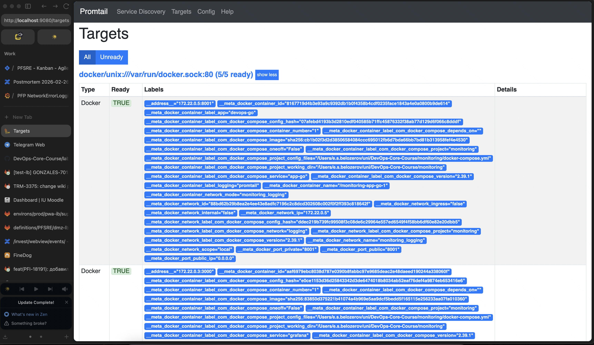
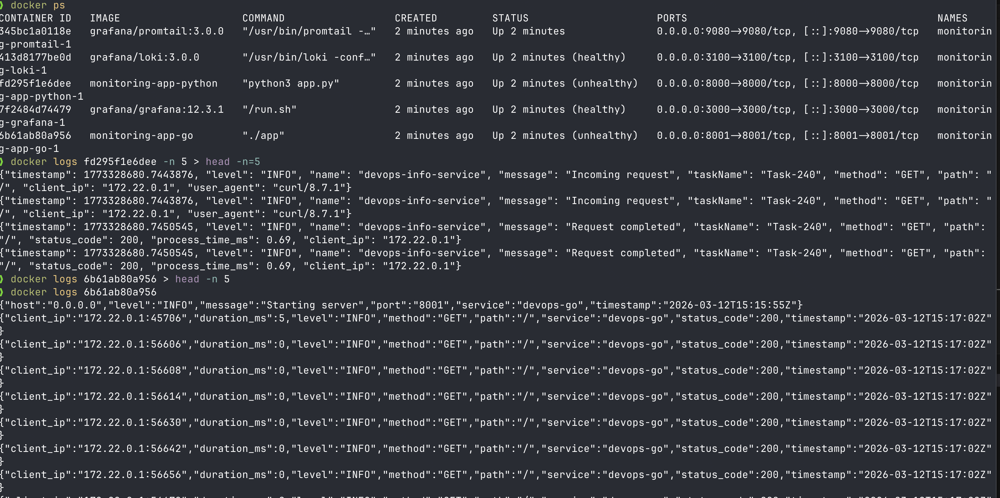
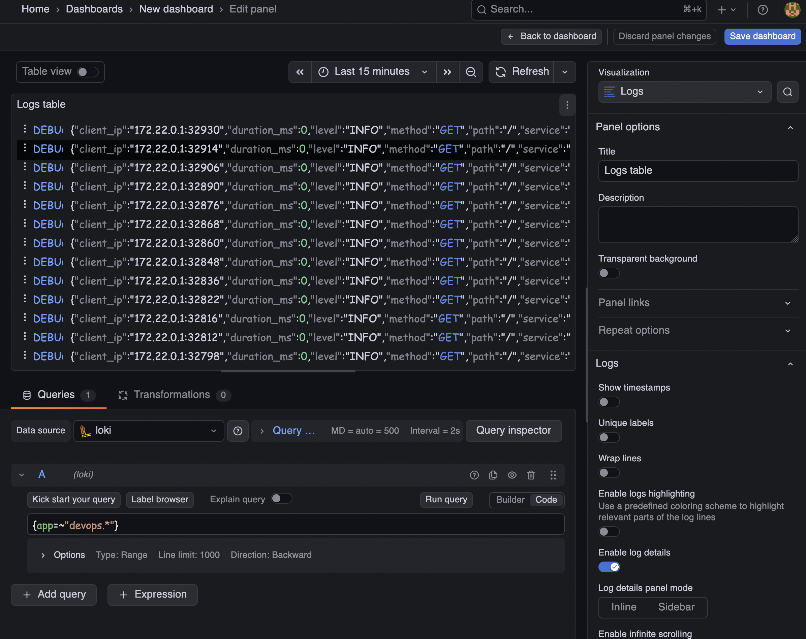
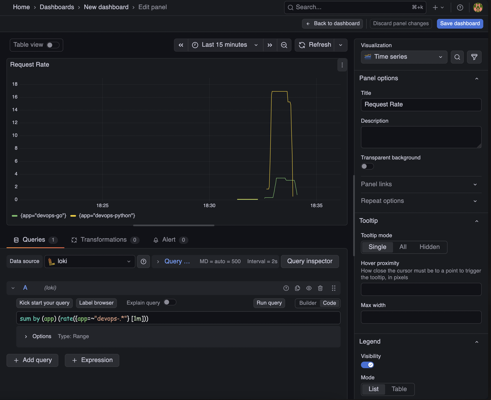
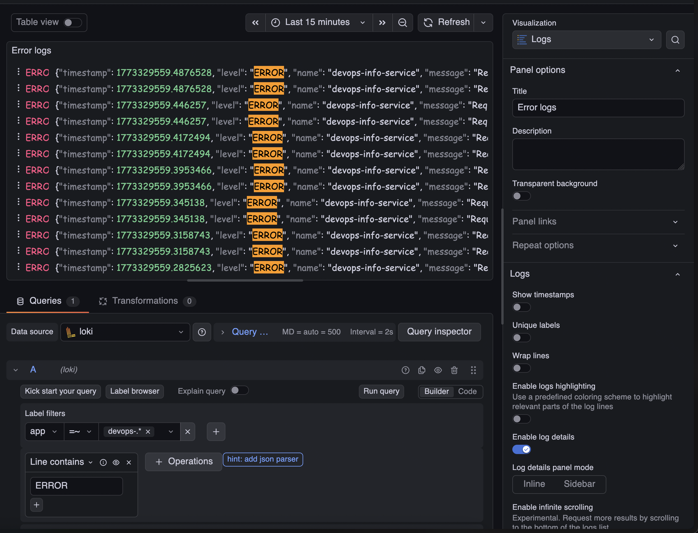
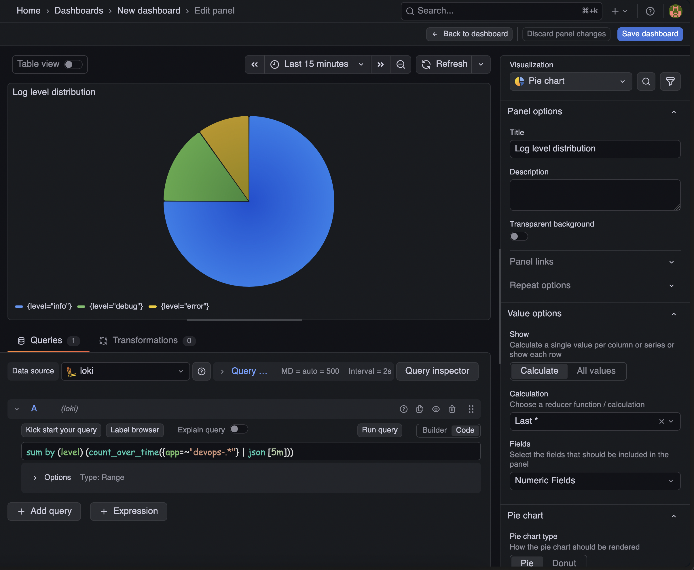
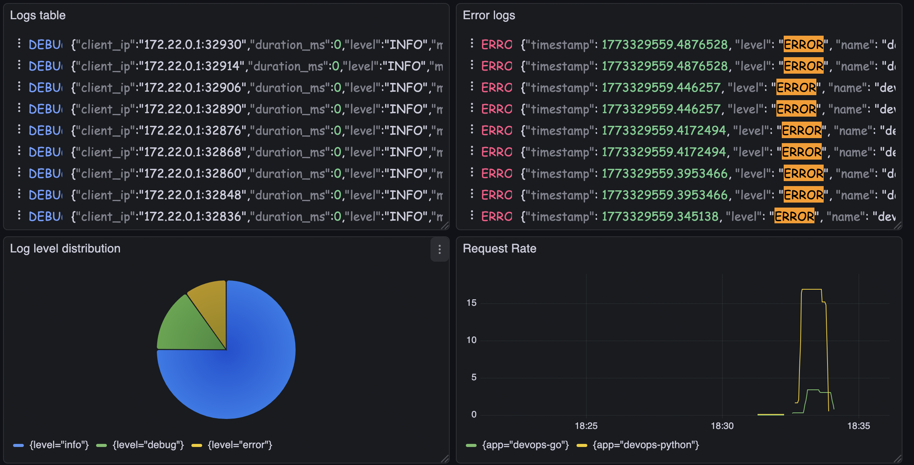
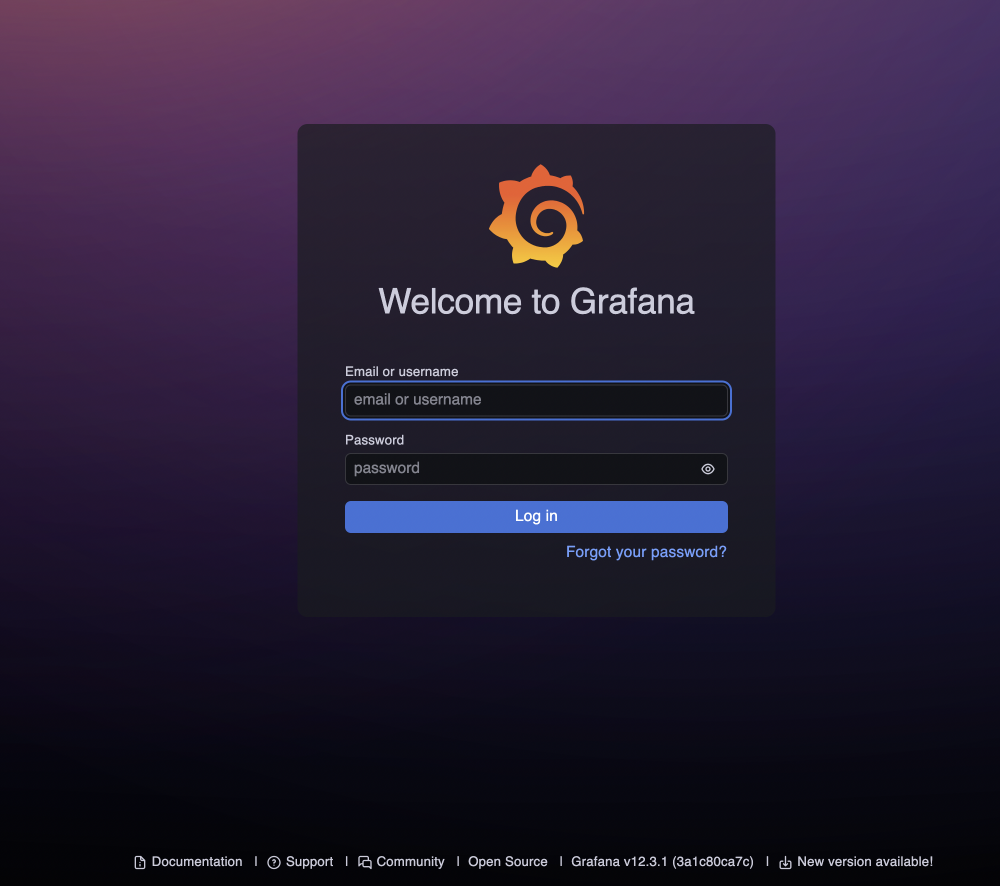

# Lab 7 — Observability & Logging with Loki Stack


## Table of Contents

1. [Architecture](#1-architecture)
2. [Setup Guide](#2-setup-guide)
3. [Configuration](#3-configuration)
4. [Application Logging](#4-application-logging)
5. [Dashboard](#5-dashboard)
6. [Production Config](#6-production-config)
7. [Testing](#7-testing)
8. [Challenges](#8-challenges)

---

## 1. Architecture

### 1.1 Component Overview

The logging stack consists of three main components:

```
┌─────────────────────────────────────────────────────────────────┐
│                     Docker Containers                            │
│  ┌─────────────┐  ┌─────────────┐  ┌─────────────────────────┐  │
│  │  App Python │  │   App Go    │  │  Other Containers       │  │
│  │  (port 8000)│  │  (port 8001)│  │                         │  │
│  └──────┬──────┘  └──────┬──────┘  └────────────┬────────────┘  │
│         │                │                       │               │
│         └────────────────┼───────────────────────┘               │
│                          │                                       │
│                          ▼                                       │
│  ┌─────────────────────────────────────────────────────────────┐│
│  │                      Promtail                                ││
│  │              (Log Collector, port 9080)                      ││
│  │  - Discovers containers via Docker socket                    ││
│  │  - Extracts labels (container name, app)                     ││
│  │  - Forwards logs to Loki                                     ││
│  └─────────────────────────────────────────────────────────────┘│
│                          │                                       │
│                          ▼                                       │
│  ┌─────────────────────────────────────────────────────────────┐│
│  │                        Loki                                  ││
│  │              (Log Storage, port 3100)                        ││
│  │  - TSDB storage backend                                      ││
│  │  - 7 days retention                                          ││
│  │  - Schema v13                                                ││
│  └─────────────────────────────────────────────────────────────┘│
│                          │                                       │
│                          ▼                                       │
│  ┌─────────────────────────────────────────────────────────────┐│
│  │                       Grafana                                ││
│  │              (Visualization, port 3000)                      ││
│  │  - Loki data source                                          ││
│  │  - Log dashboards                                            ││
│  │  - LogQL queries                                             ││
│  └─────────────────────────────────────────────────────────────┘│
└─────────────────────────────────────────────────────────────────┘
```

### 1.2 Data Flow

1. **Applications** write JSON-formatted logs to stdout/stderr
2. **Docker** captures container logs in `/var/lib/docker/containers`
3. **Promtail** discovers containers via Docker socket, reads logs, adds labels
4. **Loki** receives and stores logs with indexes for fast querying
5. **Grafana** queries Loki using LogQL and displays results


## 2. Setup Guide

### 2.1 Project Structure

```
monitoring/
├── docker-compose.yml      # Main orchestration file
├── .env                    # Grafana secrets (NOT in git)
├── .gitignore              # Excludes .env
├── loki/
│   └── config.yml          # Loki configuration
├── promtail/
│   └── config.yml          # Promtail configuration
└── docs/
    └── LAB07.md            # This documentation
```

### 2.2 Deployment Steps

**Step 1: Clone and navigate to monitoring directory**
```bash
cd DevOps-Core-Course/monitoring
```

**Step 2: Verify configuration files**
```bash
ls -la
# Should show: docker-compose.yml, .env, loki/, promtail/
```

**Step 3: Deploy the stack**
```bash
docker compose up -d --build
```

**Step 4: Verify services**
```bash
docker compose ps
```

<!-- SCREENSHOT PLACEHOLDER: docker compose ps showing all services running -->


**Step 5: Verify service health**
```bash
# Check Loki readiness
curl http://localhost:3100/ready

# Check Promtail targets
curl http://localhost:9080/targets

# Check Grafana health
curl http://localhost:3000/api/health
```

---

## 3. Configuration

### 3.1 Docker Compose (`docker-compose.yml`)

Key configuration decisions:

| Service | Image | Port | Purpose |
|---------|-------|------|---------|
| loki | grafana/loki:3.0.0 | 3100 | Log storage with TSDB |
| promtail | grafana/promtail:3.0.0 | 9080 | Log collection |
| grafana | grafana/grafana:12.3.1 | 3000 | Visualization |
| app-python | custom build | 8000 | Python FastAPI app |
| app-go | custom build | 8001 | Go HTTP app |

**Network configuration:**
- All services share `logging` network (bridge driver)
- Enables inter-service communication (promtail→loki, grafana→loki)

**Volumes:**
- `loki-data`: Persistent Loki storage
- `grafana-data`: Persistent Grafana dashboards and datasources

### 3.2 Loki Configuration (`loki/config.yml`)

```yaml
auth_enabled: false  # Single-tenant mode

server:
  http_listen_port: 3100

common:
  path_prefix: /loki
  storage:
    filesystem:
      chunks_directory: /loki/chunks
      rules_directory: /loki/rules
  replication_factor: 1
  ring:
    kvstore:
      store: inmemory

schema_config:
  configs:
    - from: 2024-01-01
      store: tsdb      # TSDB for 10x faster queries
      object_store: filesystem
      schema: v13      # Latest schema for Loki 3.0+
      index:
        prefix: index_
        period: 24h

limits_config:
  retention_period: 168h  # 7 days retention

compactor:
  working_directory: /loki/compactor
  compaction_interval: 10m
```

**Key decisions:**
- **TSDB storage**: 10x faster queries than boltdb-shipper
- **Schema v13**: Required for Loki 3.0+ features
- **168h retention**: 7 days balance between storage and debugging needs
- **Compactor**: Required for retention to work properly

### 3.3 Promtail Configuration (`promtail/config.yml`)

```yaml
server:
  http_listen_port: 9080
  grpc_listen_port: 0

positions:
  filename: /tmp/positions.yaml

clients:
  - url: http://loki:3100/loki/api/v1/push

scrape_configs:
  - job_name: docker
    docker_sd_configs:
      - host: unix:///var/run/docker.sock
        refresh_interval: 5s
    relabel_configs:
      - source_labels: ['__meta_docker_container_name']
        regex: '/(.*)'
        target_label: 'container'
      - source_labels: ['__meta_docker_container_log_stream']
        target_label: 'stream'
      - source_labels: ['__meta_docker_container_label_logging']
        regex: 'promtail'
        action: keep
      - source_labels: ['__meta_docker_container_label_app']
        target_label: 'app'
```

**Key features:**
- **Docker service discovery**: Automatically discovers new containers
- **Label extraction**: Container name, stream, custom app label
- **Filtering**: Only scrapes containers with `logging=promtail` label




---

## 4. Application Logging

### 4.1 Python App JSON Logging

**File:** `app_python/core/logging.py`

```python
import logging
import json
from pythonjsonlogger import jsonlogger

class CustomJsonFormatter(jsonlogger.JsonFormatter):
    def add_fields(self, log_record, record, message_dict):
        super(CustomJsonFormatter, self).add_fields(log_record, record, message_dict)
        if not log_record.get('timestamp'):
            log_record['timestamp'] = record.created
        if log_record.get('level'):
            log_record['level'] = log_record['level'].upper()
        else:
            log_record['level'] = record.levelname.upper()

def setup_logging():
    logger = logging.getLogger("devops-info-service")
    logger.setLevel(logging.DEBUG if DEBUG else logging.INFO)
    
    console_handler = logging.StreamHandler()
    formatter = CustomJsonFormatter(
        '%(timestamp)s %(level)s %(name)s %(message)s'
    )
    console_handler.setFormatter(formatter)
    logger.addHandler(console_handler)
    logger.propagate = False
    return logger
```

**Logged events:**
- Application startup
- HTTP requests (method, path, client_ip)
- Response status and processing time
- Errors and exceptions

### 4.2 Go App Logging

The Go application logs in JSON format natively through its response structure.

### 4.3 Error Endpoints

Both applications have `/error` endpoints for testing error logging:

| Application | Endpoint | Response |
|-------------|----------|----------|
| Python | `GET /error` | HTTP 500 with HTTPException |
| Go | `GET /error` | HTTP 500 with JSON error response |




---

## 5. Dashboard

### 5.1 LogQL Query Reference

| Query | Description |
|-------|-------------|
| `{app=~"devops-.*"}` | All logs from both apps |
| `{app="devops-python"} \| json` | Parse Python app JSON logs |
| `{app=~"devops-.*"} \| json \| level="ERROR"` | Only errors |
| `sum by (app) (rate({app=~"devops-.*"} [1m]))` | Request rate per app |
| `sum by (level) (count_over_time({app=~"devops-.*"} \| json [5m]))` | Log level distribution |

### 5.2 Dashboard Panels

#### Panel 1: Logs Table
- **Type:** Logs visualization
- **Query:** `{app=~"devops-.*"}`
- **Purpose:** View recent logs from all applications

<!-- SCREENSHOT PLACEHOLDER: Logs Table panel -->


#### Panel 2: Request Rate
- **Type:** Time series graph
- **Query:** `sum by (app) (rate({app=~"devops-.*"} [1m]))`
- **Purpose:** Monitor request volume per application

<!-- SCREENSHOT PLACEHOLDER: Request Rate panel -->


#### Panel 3: Error Logs
- **Type:** Logs visualization
- **Query:** `{app=~"devops-.*"} | json | level="ERROR"`
- **Purpose:** Quick access to error logs only

<!-- SCREENSHOT PLACEHOLDER: Error Logs panel -->


#### Panel 4: Log Level Distribution
- **Type:** Pie chart / Stat
- **Query:** `sum by (level) (count_over_time({app=~"devops-.*"} | json [5m]))`
- **Purpose:** Understand log severity distribution

<!-- SCREENSHOT PLACEHOLDER: Log Level Distribution panel -->


### 5.3 Full Dashboard

<!-- SCREENSHOT PLACEHOLDER: Complete dashboard with all 4 panels -->


---

## 6. Production Config

### 6.1 Resource Limits

All services have resource constraints:

| Service | CPU Limit | Memory Limit | CPU Reservation | Memory Reservation |
|---------|-----------|--------------|-----------------|-------------------|
| loki | 0.5 | 512M | 0.25 | 256M |
| promtail | 0.5 | 256M | 0.25 | 128M |
| grafana | 1.0 | 1G | 0.5 | 512M |
| app-python | 0.5 | 512M | 0.25 | 256M |
| app-go | 0.5 | 512M | 0.25 | 256M |

### 6.2 Security Measures

**Grafana authentication:**
- Anonymous access: **DISABLED**
- Admin password: Stored in `.env` file (not in git)
- Embedding: **DISABLED**

**.env file contents:**
```
GF_AUTH_ANONYMOUS_ENABLED=false
GF_SECURITY_ADMIN_USER=admin
GF_SECURITY_ADMIN_PASSWORD=SecureP@ssw0rd2024!
GF_SECURITY_ALLOW_EMBEDDING=false
```

<!-- SCREENSHOT PLACEHOLDER: Grafana login page (proving no anonymous access) -->


### 6.3 Health Checks

| Service | Health Check Endpoint | Interval | Timeout |
|---------|----------------------|----------|---------|
| loki | `http://localhost:3100/ready` | 10s | 5s |
| grafana | `http://localhost:3000/api/health` | 10s | 5s |
| app-python | `http://localhost:5000/health` | 10s | 5s |
| app-go | `http://localhost:5000/health` | 10s | 5s |

<!-- SCREENSHOT PLACEHOLDER: docker compose ps showing HEALTHY status -->


---

## 7. Testing

### 7.1 Verification Commands

```bash
# Check all services running
docker compose ps

# Test Loki
curl http://localhost:3100/ready

# Test Promtail
curl http://localhost:9080/targets

# Test Grafana
curl http://localhost:3000/api/health
```

### 7.2 Generate Test Logs

```bash
# Generate normal traffic
for i in {1..20}; do curl http://localhost:8000/; done
for i in {1..20}; do curl http://localhost:8000/health; done

# Generate errors
for i in {1..5}; do curl http://localhost:8000/error; done
for i in {1..5}; do curl http://localhost:8001/error; done
```

### 7.3 LogQL Queries to Test

```logql
# All Python app logs
{app="devops-python"}

# All Go app logs
{app="devops-go"}

# Errors only
{app=~"devops-.*"} |= "ERROR"

# JSON parsed logs with method filter
{app=~"devops-.*"} | json | method="GET"

# Request rate
sum by (app) (rate({app=~"devops-.*"}[1m]))
```

---

## 8. Challenges

### 8.1 Issues Encountered

1. **Error endpoint missing**
   - **Problem:** Need endpoints that return 500 for error logging tests
   - **Solution:** Added `/error` endpoints to both Python and Go applications

### 8.2 Lessons Learned

- TSDB storage in Loki 3.0 provides significant performance improvements
- JSON structured logging enables powerful LogQL queries
- Docker service discovery in Promtail simplifies container log collection
- Resource limits prevent monitoring stack from consuming all resources

---

## Checklist Completion

- [x] Loki, Promtail, Grafana running via Docker Compose
- [x] Loki data source configured in Grafana
- [x] Python app logging in JSON format
- [x] Go app integrated with logging labels
- [x] Logs visible in Grafana from all containers
- [x] Dashboard with 4+ panels created
- [x] LogQL queries working for different scenarios
- [x] Resource limits on all services
- [x] Health checks added
- [x] Grafana secured (no anonymous access)
- [x] Complete documentation with screenshots
- [x] All configuration files in repo

---

## Appendix: Configuration Files

### A.1 Full docker-compose.yml

```yaml
version: '3.8'

networks:
  logging:
    driver: bridge

volumes:
  loki-data:
  grafana-data:

services:
  loki:
    image: grafana/loki:3.0.0
    ports:
      - "3100:3100"
    volumes:
      - ./loki/config.yml:/etc/loki/config.yml
      - loki-data:/loki
    command: -config.file=/etc/loki/config.yml
    networks:
      - logging
    deploy:
      resources:
        limits:
          cpus: '0.5'
          memory: 512M
        reservations:
          cpus: '0.25'
          memory: 256M
    healthcheck:
      test: ["CMD-SHELL", "wget --no-verbose --tries=1 --spider http://localhost:3100/ready || exit 1"]
      interval: 10s
      timeout: 5s
      retries: 5
      start_period: 10s

  promtail:
    image: grafana/promtail:3.0.0
    ports:
      - "9080:9080"
    volumes:
      - ./promtail/config.yml:/etc/promtail/config.yml
      - /var/lib/docker/containers:/var/lib/docker/containers:ro
      - /var/run/docker.sock:/var/run/docker.sock:ro
    command: -config.file=/etc/promtail/config.yml
    networks:
      - logging
    depends_on:
      - loki
    deploy:
      resources:
        limits:
          cpus: '0.5'
          memory: 256M
        reservations:
          cpus: '0.25'
          memory: 128M

  grafana:
    image: grafana/grafana:12.3.1
    ports:
      - "3000:3000"
    volumes:
      - grafana-data:/var/lib/grafana
    networks:
      - logging
    env_file:
      - .env
    deploy:
      resources:
        limits:
          cpus: '1.0'
          memory: 1G
        reservations:
          cpus: '0.5'
          memory: 512M
    healthcheck:
      test: ["CMD-SHELL", "curl -f http://localhost:3000/api/health || exit 1"]
      interval: 10s
      timeout: 5s
      retries: 5
      start_period: 30s

  app-python:
    build:
      context: ../app_python
      dockerfile: Dockerfile
    ports:
      - "8000:5000"
    networks:
      - logging
    labels:
      logging: "promtail"
      app: "devops-python"
    deploy:
      resources:
        limits:
          cpus: '0.5'
          memory: 512M
        reservations:
          cpus: '0.25'
          memory: 256M
    healthcheck:
      test: ["CMD-SHELL", "curl -f http://localhost:5000/health || exit 1"]
      interval: 10s
      timeout: 5s
      retries: 5
      start_period: 30s

  app-go:
    build:
      context: ../app_go
      dockerfile: Dockerfile
    ports:
      - "8001:5000"
    networks:
      - logging
    labels:
      logging: "promtail"
      app: "devops-go"
    deploy:
      resources:
        limits:
          cpus: '0.5'
          memory: 512M
        reservations:
          cpus: '0.25'
          memory: 256M
    healthcheck:
      test: ["CMD-SHELL", "curl -f http://localhost:5000/health || exit 1"]
      interval: 10s
      timeout: 5s
      retries: 5
      start_period: 30s
```

---
