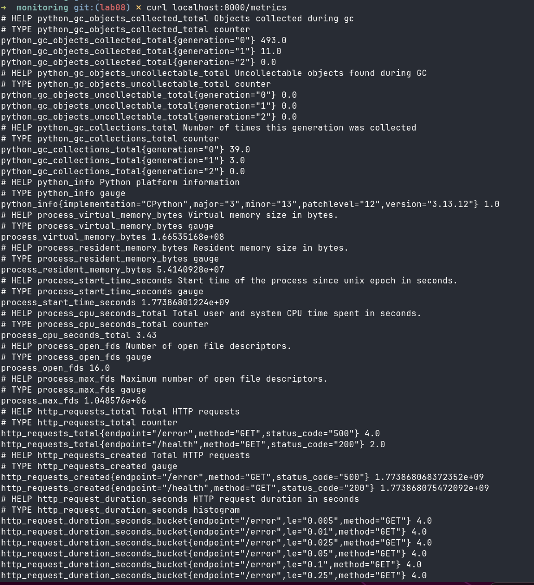
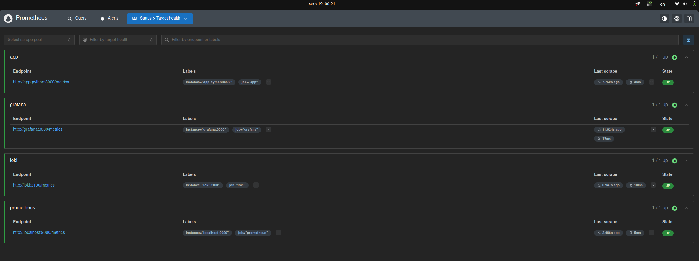
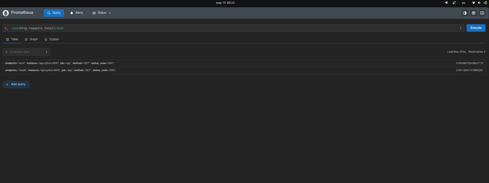
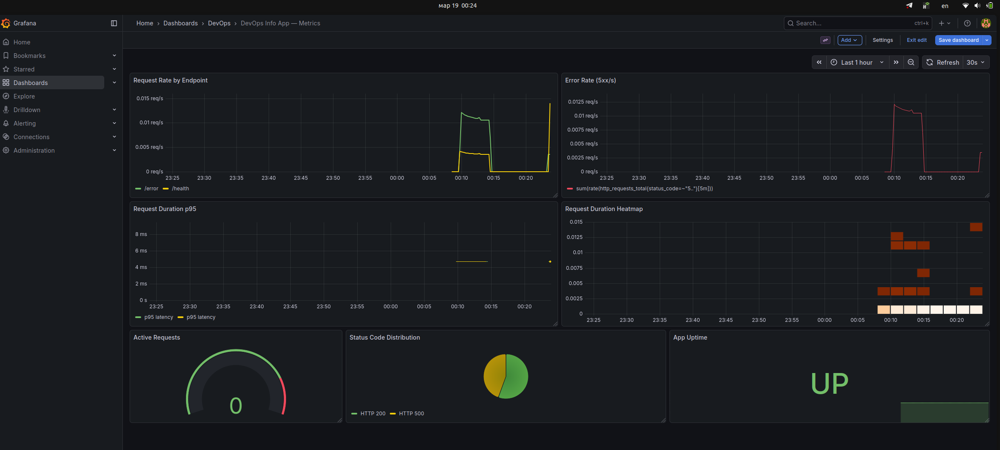
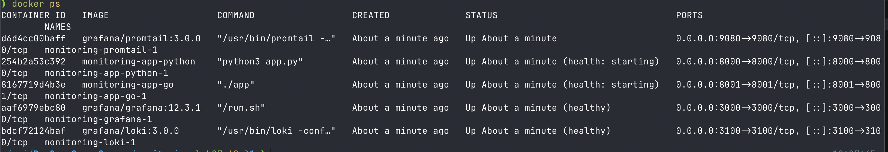

# Lab 08 — Metrics & Monitoring with Prometheus

## 1. Architecture

```
┌─────────────────────────────────────────────────────┐
│                   Docker Network: logging            │
│                                                     │
│  ┌──────────────┐   scrape /metrics   ┌───────────┐ │
│  │  app-python  │ ──────────────────► │Prometheus │ │
│  │   :8000      │                     │  :9090    │ │
│  └──────────────┘                     └─────┬─────┘ │
│                                             │ query  │
│  ┌──────────────┐   scrape /metrics         ▼        │
│  │    Loki      │ ──────────────────► ┌───────────┐ │
│  │   :3100      │                     │  Grafana  │ │
│  └──────────────┘                     │  :3000    │ │
│                                       └───────────┘ │
│  ┌──────────────┐   scrape /metrics         ▲        │
│  │  Prometheus  │ ──────────────────┘        │       │
│  │  (self)      │                     logs   │       │
│  └──────────────┘   ┌──────────┐ ──────────┘        │
│                      │Promtail │                     │
│                      │  :9080  │                     │
│                      └──────────┘                    │
└─────────────────────────────────────────────────────┘
```

Metric flow: **App → Prometheus (pull/scrape) → Grafana (query/visualise)**

---

## 2. Application Instrumentation

### `/metrics` endpoint output



### Metrics defined in `app_python/core/metrics.py`

| Metric | Type | Labels | Purpose (RED) |
|--------|------|--------|---------------|
| `http_requests_total` | Counter | method, endpoint, status_code | **Rate** & **Errors** |
| `http_request_duration_seconds` | Histogram | method, endpoint | **Duration** |
| `http_requests_in_progress` | Gauge | — | Concurrency |
| `devops_info_endpoint_calls_total` | Counter | endpoint | Business metric |
| `devops_info_system_collection_seconds` | Histogram | — | Internal perf |

**Why these metrics?**
- `http_requests_total` covers both Rate (req/s via `rate()`) and Errors (filter by `status_code=~"5.."`).
- `http_request_duration_seconds` enables latency percentile queries with `histogram_quantile()`.
- `http_requests_in_progress` tracks concurrency, useful for diagnosing queue build-up.
- Business metrics make the service observable at the domain level, not just the transport level.

**Middleware approach:** A single async FastAPI middleware (`log_requests`) records all three HTTP metrics per request, excluding the `/metrics` endpoint itself to avoid feedback loops.

---

## 3. Prometheus Configuration

**File:** `monitoring/prometheus/prometheus.yml`

```yaml
global:
  scrape_interval: 15s

scrape_configs:
  - job_name: 'prometheus'   # self-monitoring
  - job_name: 'app'          # app-python:8000/metrics
  - job_name: 'loki'         # loki:3100/metrics
  - job_name: 'grafana'      # grafana:3000/metrics
```

**Retention:** 15 days / 10 GB (set via CLI flags in docker-compose.yml)

### All targets UP



### PromQL query — `rate(http_requests_total[15m])`



---

## 4. Dashboard Walkthrough

Dashboard file: `monitoring/grafana/dashboards/app-metrics.json`

| Panel | Type | Query | Purpose |
|-------|------|-------|---------|
| Request Rate by Endpoint | Time series | `sum by (endpoint) (rate(http_requests_total[5m]))` | RED — Rate |
| Error Rate (5xx/s) | Time series | `sum(rate(http_requests_total{status_code=~"5.."}[5m]))` | RED — Errors |
| Request Duration p95 | Time series | `histogram_quantile(0.95, rate(http_request_duration_seconds_bucket[5m]))` | RED — Duration |
| Request Duration Heatmap | Heatmap | `rate(http_request_duration_seconds_bucket[5m])` | Latency distribution |
| Active Requests | Gauge | `http_requests_in_progress` | Concurrency |
| Status Code Distribution | Pie chart | `sum by (status_code) (rate(http_requests_total[5m]))` | 2xx/4xx/5xx split |
| App Uptime | Stat | `up{job="app"}` | Service health |

### Dashboard with live data



---

## 5. PromQL Examples

```promql
# 1. Request rate per second (RED: Rate)
rate(http_requests_total[5m])

# 2. Total req/s across all endpoints
sum(rate(http_requests_total[5m]))

# 3. Error rate — 5xx per second (RED: Errors)
sum(rate(http_requests_total{status_code=~"5.."}[5m]))

# 4. 95th percentile latency (RED: Duration)
histogram_quantile(0.95, rate(http_request_duration_seconds_bucket[5m]))

# 5. Per-endpoint p95 latency
histogram_quantile(0.95, sum by (le, endpoint) (rate(http_request_duration_seconds_bucket[5m])))

# 6. Services currently down
up == 0

# 7. CPU usage of the app process
rate(process_cpu_seconds_total{job="app"}[5m]) * 100

# 8. Business metric — calls to each endpoint
rate(devops_info_endpoint_calls_total[5m])
```

---

## 6. Production Setup

### Health Checks
All services declare `healthcheck` blocks. Docker reports `healthy` / `unhealthy` per container.

### Resource Limits

| Service | CPU | Memory |
|---------|-----|--------|
| Prometheus | 1.0 | 1 G |
| Loki | 1.0 | 1 G |
| Grafana | 0.5 | 512 M |
| app-python | 0.5 | 256 M |
| Promtail | 0.5 | 256 M |

### Data Retention
- **Prometheus:** `--storage.tsdb.retention.time=15d`, `--storage.tsdb.retention.size=10GB`
- **Loki:** `retention_period: 168h` (7 days) in `loki/config.yml`

### Persistent Volumes
```yaml
volumes:
  prometheus-data:   # Prometheus TSDB
  loki-data:         # Loki chunks + index
  grafana-data:      # Grafana DB (dashboards, users)
```
Containers can be restarted or replaced without losing data.

---

## 7. Testing Results

### Services healthy — `docker compose ps`



### `/metrics` endpoint output


### Prometheus — all targets UP


### PromQL query result


### Grafana dashboard with live data


---

## 8. Challenges & Solutions

| Challenge | Solution |
|-----------|----------|
| FastAPI is ASGI, not Flask — `before_request` / `after_request` hooks don't exist | Used a single `@app.middleware("http")` to track start time, status code, and duration atomically |
| `/metrics` endpoint itself creates noise in metrics | Added `if endpoint != "/metrics": track = True` guard in middleware |
| Grafana provisioned datasource UID must match dashboard panel datasource refs | Set explicit `uid: prometheus` in the provisioning YAML and matched it (lowercase) in every panel's datasource block in the dashboard JSON |
| Prometheus `storage` block in `prometheus.yml` is not supported in v3.x | Retention configured via CLI flags `--storage.tsdb.retention.time` and `--storage.tsdb.retention.size` |

---

## Metrics vs Logs (Lab 7 comparison)

| | Logs (Lab 7 — Loki) | Metrics (Lab 8 — Prometheus) |
|--|---------------------|------------------------------|
| **What** | Discrete events with context | Aggregated numeric measurements |
| **When to use** | Debugging specific requests, tracing errors | Trending, alerting, capacity planning |
| **Query** | LogQL — text search | PromQL — math on time series |
| **Storage cost** | Higher (full text) | Lower (numbers + labels) |
| **Example** | "Request from 1.2.3.4 failed with 500" | "500 error rate is 0.03/s over last 5 min" |
